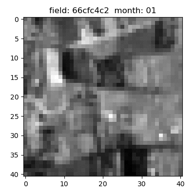

## lacuna
-predicting locations of maize fields in east Africa based on low resolution satellite images (competition hosted [@Zindi](https://zindi.africa/competitions/lacuna-correct-field-detection-challenge))

I've worked on this project leading a team ('Maizefinder') of 4 Ph.Ds from diverse backgrounds as part of the [Erdos Institute DataScience Bootcamp - 2021](https://www.erdosinstitute.org/code). Our work was selected as a top project (#2 out of 55 teams):

* [Tuguldur Sukhbold](https://www.linkedin.com/in/tuguldurs/) (astrophysics)
* [Michael Darcy](https://www.linkedin.com/in/michael-darcy/) (biophysics)
* [Pol Arranz-Gibert](https://www.linkedin.com/in/pol-a-59973614b/) (chemistry)
* [AJ Adejaire](https://www.linkedin.com/in/aj-adejare/) (biomedical informatics)

[slides](https://docs.google.com/presentation/d/1QEwQ5oUqYZRaDev0mCwEx2z7KptmuQ-o-VEcQPdvX44/present?slide=id.p)  |  [presentation](https://www.erdosinstitute.org/may2021projects/team-7)  |  [actionable insights](https://drive.google.com/file/d/12TU2qkwaoCWCh6b2cmA7-sMACqJ7LoNV/view)  |  [certificate](https://www.erdosinstitute.org/may2021certificates/tuguldur-sukhbold)

### The challenge and our approach

Essentially we are provided with information on nearly 3000 small maize fields, where roughly half are our training set. For each field in the training set we have data on x/y-offsets between the image and maize field centers, a very approximate area of the field, and a subjective image quality score. For a few of them we also had an approximate crop yield for a given year.

Each field is also associated with down-sampled imagery from two satellites - [Planet](https://www.planet.com/) and [Sentinel-2](https://sentinel.esa.int/web/sentinel/missions/sentinel-2). Planet images had slightly better resolution (~5m/px) but only given at 4 epochs between 2017-19 and were in simple RGB format; the Sentinel-2 images had much broader temporal (every month of 2015) and spectral coverage (11 bands), but their resolution was extremely poor, roughly at ~10m/px.

 

compilation of Sentinel-2 images for a sample field (every month of 2015):
 

 
Planet data for the same sample field (4 epochs between 2017-19):
 

 

The yield data were barely usable, not only because they are highly inaccurate and mostly NaN, but because they are tightly correlated with the area data (we suspect they were derived from the area, not an independent measurement). The area information is good to within a factor of 2-3, the displacements were not always centered, and the images often suffered from jitter, cloud cover, aerosol darkening and blurring.

The goal here was to predict the displacement vector given the low resolution images and approximate plot size area. We started from a simple toy model (without any machine learning components) by taking the advantage of underlying global trends in the training data and by utilizing [Sentinel-2 based vegetation index](https://natureconservation.pensoft.net/article/29588/) developed by the remote sensing community. We then explored image segmentation approach based on R-CNN (using ResNet50 trained on the COCO-dataset), where we have developed a custom labeling script using <code>pygame</code> package. And finally we have developed an unsupervised approach to perform continuous classification based on pre-trained ResNet152 model. Our overall best model had a mean absolute error of only 230 meters in displacement distance.
